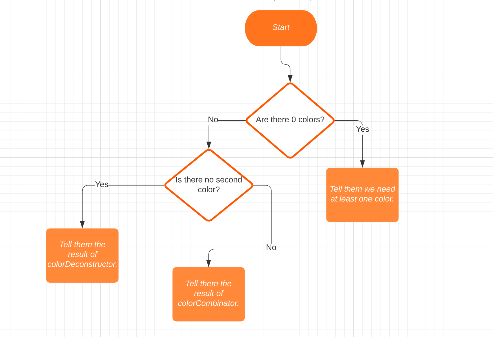
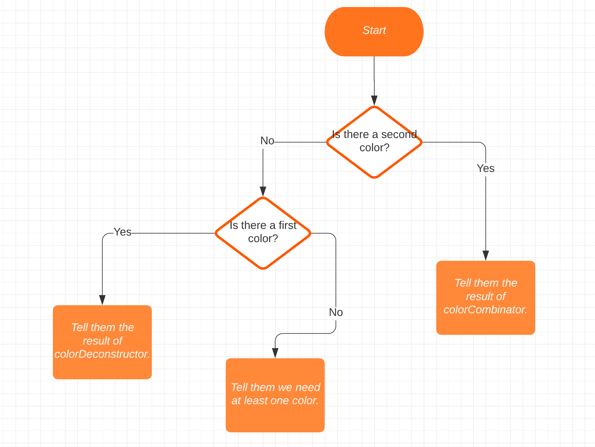

# Color Cleaver

### Introduction

This is the full app version of [color-cleaver-backend](https://github.com/ci-wdi-900/color-cleaver-backend), with front end and everything. The logic's there, we just need an interface!

### Workflow

The entire back end has been completed for you. You'll be working entirely in `main.js`.

### Steps

1.  The first thing we need to do is grab our users' input. There might be as many as two,  so grab two `process.argv` return values (being careful about the indices!) and put them in variables.
2. Now we'll need to take into account that some of those values might be `undefined`. Note that that's not a string, it's a value--no quotes! We'll want to send them a message if BOTH are `undefined`; that means they didn't put even a single color in.
3. If there is ONE color, we want to pass it to `colorDeconstructor` and put the return value (e.g., 'red and yellow') and put it into a sentence to tell them the result in a user-friendly way.
4. If there were TWO colors, then we want to get the return value from `colorCombinator` (pasing in both of the users' colors) print that in a sentence.

And that's it! That's our whole front end! Although...

### Flowchats

The steps above are in the order a person would tackle the problems. But JavaScript is not a person (sounds like a very nerdy Dark Mirror episode though), and we'll need to handle the logic in a more computer-y way.

So here are two different flowcharts; the first one is a little strange logically, but is designed to produce less nested code. The second is easier to understand, but if you follow it exactly, you'll most likely end up with nested `if` statements. It's up to you! Or make your own!

### Stretch Goals

Coming soon!
